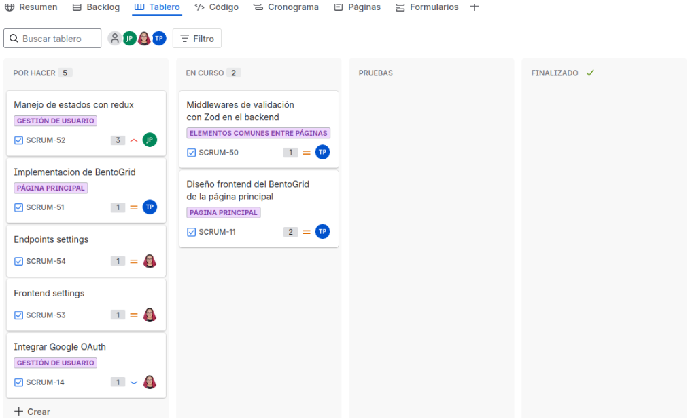

# Gestor de Tareas Colaborativo

Aplicación Fullstack colaborativa para crear, organizar y compartir tareas de forma visual y sencilla, combinando el estilo de _Google Tasks_ y _Trello_.

## Autores

## Insignias de estado

## Sprint 1 - Configuración Inicial y Primeros Pasos

- Configuración del proyecto (backend, frontend y base de datos con Prisma)
- Configuración del repositorio y tablero Jira
- Gestión de usuarios (registro, inicio de sesión)
- Primeros endpoints
- Base del diseño inicial del frontend

## Sprint 2 - Autenticación y Control de Sesión

- Implementación de login y registro funcionales
- Autenticación con Google/Auth0
- Control de sesión mediante JWT
- Gestión de estado global con React Redux
- Diseño responsivo de pantallas de login y registro
- Integración inicial del Dashboard
- **Quedaron pendientes para el siguiente sprint:**
  - Middlewares de validación con Zod en backend
  - Diseño frontend del Bento Grid de la página principal

## Sprint 3 - Pruebas y Calidad del Software

- Creación de tests unitarios frontend y backend con Vitest
- Creación de tests end-to-end con Selenium IDE
- Verificación de flujos completos de usuario (login, navegación, logout)
- Implementación de mocks de backend y frontend
- Finalización del Dashboard del sprint
- Cambio de alcance en Jira (renombrado y reorganización de tareas)

## Sprint 4 - Integración Continua y Base de la Página de Tareas

- Configuración de GitHub Actions para cliente y servidor
- Ejecución automática de pruebas en cada actualización del repositorio
- Finalización de integración de Google Auth0
- Manejo de estado con Redux aplicado a más secciones
- Implementación de endpoints necesarios para el Bento Grid
- Diseño frontend del Bento Grid de la página principal
- Ajustes de usuario (nombre, contraseña, notificaciones)
- Preparación de la base del frontend para la página de tareas
- Inicio de implementación de funcionalidades de tareas
- _Inconveniente:_ No se pudo completar la integración con Coveralls debido a falta de permisos para hacer el repositorio público. Solicitud de acceso pendiente por parte de la organización de la asignatura

## Stack Tecnológico

